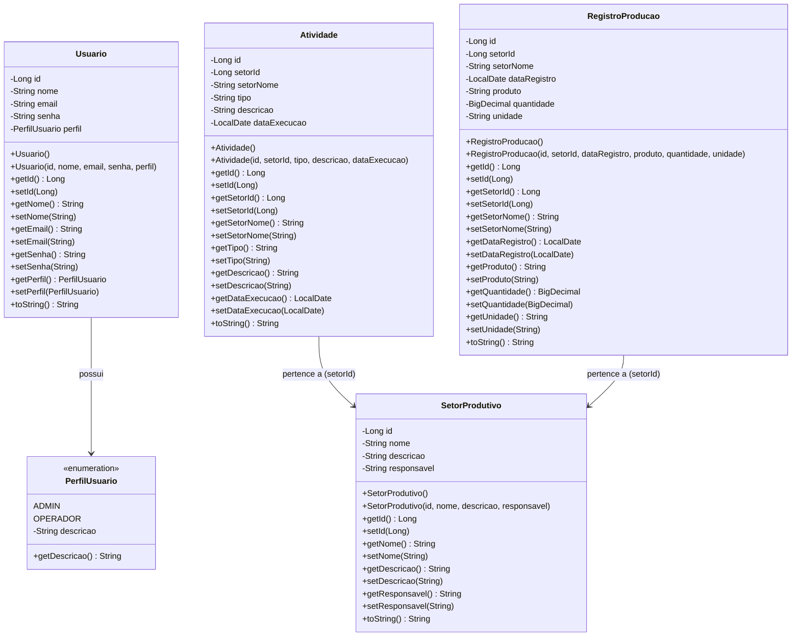
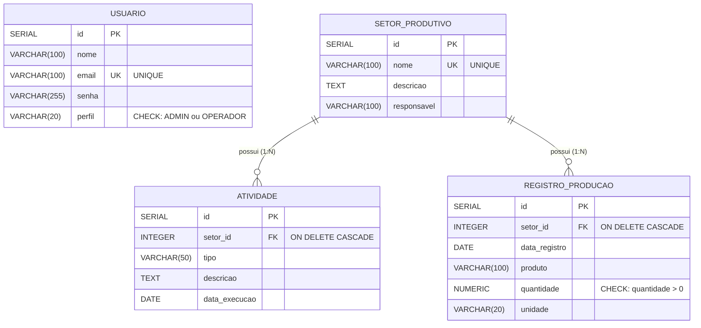

# SIGEAJ - Sistema de Gestão de Setores Produtivos da EAJ

Sistema desenvolvido em Java com JavaFX para gerenciar os setores produtivos da Escola Agrícola de Jundiaí (EAJ).

## Tecnologias Utilizadas

- **Java 21 LTS**
- **JavaFX 21** - Interface gráfica
- **FXML / Scene Builder** - Design de interfaces
- **PostgreSQL** - Banco de dados
- **JDBC** - Acesso a dados
- **Maven** - Gerenciamento de dependências

## Arquitetura

O projeto segue rigorosamente o padrão **MVC (Model-View-Controller)** e os princípios de **Programação Orientada a Objetos (POO)**:

### Camadas do Sistema

```
src/br/edu/ufrn/sigeaj/
│
├── Main.java                      # Classe principal JavaFX
│
├── model/                         # MODEL - Entidades de domínio
│   ├── Usuario.java               # Entidade usuário (encapsulamento)
│   ├── SetorProdutivo.java        # Entidade setor produtivo
│   ├── Atividade.java             # Entidade atividade (associação)
│   ├── RegistroProducao.java      # Entidade registro de produção
│   └── PerfilUsuario.java         # Enum de perfis
│
├── dao/                           # PERSISTÊNCIA - Acesso a dados
│   ├── UsuarioDAO.java            # CRUD de usuários
│   ├── SetorProdutivoDAO.java     # CRUD de setores
│   ├── AtividadeDAO.java          # CRUD de atividades
│   └── RegistroProducaoDAO.java   # CRUD de registros
│
├── service/                       # NEGÓCIO - Regras de negócio
│   ├── UsuarioService.java        # Validações de usuário
│   ├── SetorProdutivoService.java # Validações de setor
│   ├── AtividadeService.java      # Validações de atividade
│   └── RegistroProducaoService.java # Validações de registro
│
├── controller/                    # CONTROLLER - Lógica da interface
│   ├── LoginController.java       # Gerencia tela de login
│   ├── MainController.java        # Gerencia tela principal
│   ├── SetorProdutivoController.java
│   ├── AtividadeController.java
│   └── RegistroProducaoController.java
│
└── util/                          # UTILITÁRIOS
    └── ConnectionFactory.java     # Gerencia conexões com BD

src/main/resources/br/edu/ufrn/sigeaj/
└── view/                          # VIEW - Interfaces FXML
    ├── login.fxml                 # Tela de login
    ├── main.fxml                  # Tela principal/menu
    ├── setor_produtivo.fxml       # CRUD de setores
    ├── atividade.fxml             # CRUD de atividades
    └── registro_producao.fxml     # CRUD de registros
```

## Diagrama de Classes UML

O diagrama abaixo mostra as classes de modelo (entidades) do sistema e seus relacionamentos:



**Relacionamentos:**
- `Usuario` **possui** um `PerfilUsuario` (Enum: ADMIN ou OPERADOR)
- `Atividade` **pertence a** um `SetorProdutivo` (relacionamento via `setorId`)
- `RegistroProducao` **pertence a** um `SetorProdutivo` (relacionamento via `setorId`)

---

## Diagrama Entidade-Relacionamento (ER)

O diagrama abaixo representa a estrutura do banco de dados PostgreSQL:



**Cardinalidades:**
- Um `SETOR_PRODUTIVO` pode ter **zero ou muitas** `ATIVIDADE` (1:N)
- Um `SETOR_PRODUTIVO` pode ter **zero ou muitos** `REGISTRO_PRODUCAO` (1:N)
- Uma `ATIVIDADE` pertence a **exatamente um** `SETOR_PRODUTIVO` (N:1)
- Um `REGISTRO_PRODUCAO` pertence a **exatamente um** `SETOR_PRODUTIVO` (N:1)

**Constraints de Integridade:**
- **CASCADE DELETE**: Ao deletar um setor, todas as atividades e registros de produção relacionados são deletados automaticamente
- **UNIQUE**: Email de usuário e nome de setor devem ser únicos
- **CHECK**: Perfil deve ser 'ADMIN' ou 'OPERADOR', quantidade deve ser > 0

---

## Dicionário de Dados

Descrição detalhada de todas as tabelas e colunas do banco de dados:

### Tabela: `usuario`
Armazena os usuários do sistema com suas credenciais e perfis de acesso.

| Coluna | Tipo | Restrições | Descrição |
|--------|------|------------|-----------|
| `id` | SERIAL | PRIMARY KEY | Identificador único do usuário (auto-incremento) |
| `nome` | VARCHAR(100) | NOT NULL | Nome completo do usuário |
| `email` | VARCHAR(100) | NOT NULL, UNIQUE | Email do usuário (utilizado para login) |
| `senha` | VARCHAR(255) | NOT NULL | Senha do usuário (armazenada em texto plano) |
| `perfil` | VARCHAR(20) | NOT NULL, CHECK | Perfil de acesso: 'ADMIN' ou 'OPERADOR' |

**Índices:** PRIMARY KEY em `id`, UNIQUE em `email`

**Constraints:**
- `email_formato`: Valida formato de email com regex
- `perfil` CHECK: Aceita apenas 'ADMIN' ou 'OPERADOR'

---

### Tabela: `setor_produtivo`
Armazena os setores produtivos da Escola Agrícola (Piscicultura, Avicultura, etc).

| Coluna | Tipo | Restrições | Descrição |
|--------|------|------------|-----------|
| `id` | SERIAL | PRIMARY KEY | Identificador único do setor (auto-incremento) |
| `nome` | VARCHAR(100) | NOT NULL, UNIQUE | Nome do setor produtivo |
| `descricao` | TEXT | - | Descrição detalhada do setor |
| `responsavel` | VARCHAR(100) | - | Nome do responsável pelo setor |

**Índices:** PRIMARY KEY em `id`, UNIQUE em `nome`

**Constraints:**
- `nome` UNIQUE: Não permite setores com nomes duplicados

---

### Tabela: `atividade`
Armazena as atividades realizadas nos setores produtivos (Alimentação, Limpeza, Vacinação, etc).

| Coluna | Tipo | Restrições | Descrição |
|--------|------|------------|-----------|
| `id` | SERIAL | PRIMARY KEY | Identificador único da atividade (auto-incremento) |
| `setor_id` | INTEGER | NOT NULL, FK | Chave estrangeira para `setor_produtivo.id` |
| `tipo` | VARCHAR(50) | NOT NULL | Tipo da atividade (ex: Alimentação, Limpeza) |
| `descricao` | TEXT | - | Descrição detalhada da atividade realizada |
| `data_execucao` | DATE | NOT NULL | Data em que a atividade foi executada |

**Índices:**
- PRIMARY KEY em `id`
- INDEX em `setor_id` (performance)
- INDEX em `data_execucao` (performance)

**Chaves Estrangeiras:**
- `fk_atividade_setor`: `setor_id` REFERENCES `setor_produtivo(id)` ON DELETE CASCADE

**Constraints:**
- ON DELETE CASCADE: Ao deletar um setor, todas as atividades são deletadas automaticamente

---

### Tabela: `registro_producao`
Armazena os registros de produção dos setores (quantidade de produtos produzidos).

| Coluna | Tipo | Restrições | Descrição |
|--------|------|------------|-----------|
| `id` | SERIAL | PRIMARY KEY | Identificador único do registro (auto-incremento) |
| `setor_id` | INTEGER | NOT NULL, FK | Chave estrangeira para `setor_produtivo.id` |
| `data_registro` | DATE | NOT NULL | Data do registro da produção |
| `produto` | VARCHAR(100) | NOT NULL | Nome do produto produzido |
| `quantidade` | NUMERIC(10,2) | NOT NULL, CHECK | Quantidade produzida (precisão de 2 casas decimais) |
| `unidade` | VARCHAR(20) | NOT NULL | Unidade de medida (kg, litros, unidades, etc) |

**Índices:**
- PRIMARY KEY em `id`
- INDEX em `setor_id` (performance)
- INDEX em `data_registro` (performance)

**Chaves Estrangeiras:**
- `fk_registro_setor`: `setor_id` REFERENCES `setor_produtivo(id)` ON DELETE CASCADE

**Constraints:**
- `quantidade` CHECK: Quantidade deve ser maior que zero (quantidade > 0)
- ON DELETE CASCADE: Ao deletar um setor, todos os registros de produção são deletados automaticamente

---

## Conceitos de POO Demonstrados

1. **Encapsulamento**: Atributos privados com getters/setters em todas as entidades
2. **Associação**: Atividade e RegistroProducao associados a SetorProdutivo
3. **Composição**: Relacionamentos entre entidades via IDs
4. **Abstração**: Separação clara entre camadas (MVC)
5. **Enum**: PerfilUsuario como enumeração

## Padrão MVC Implementado

- **Model**: Classes de entidades em `model/`
- **View**: Arquivos FXML em `view/`
- **Controller**: Controllers JavaFX em `controller/`
- **Service**: Lógica de negócio separada em `service/`
- **DAO**: Acesso a dados isolado em `dao/`

## Pré-requisitos

1. **Java JDK 21 LTS** (ou superior)
2. **PostgreSQL 12+**
3. **Maven 3.6+**
4. **IDE**: IntelliJ IDEA ou Eclipse (opcional)
5. **Scene Builder** (opcional, para editar FXMLs visualmente)

## Configuração do Banco de Dados

### 1. Instalar PostgreSQL

### 2. Criar o banco de dados

```bash
psql -U postgres
CREATE DATABASE sigeaj;
\c sigeaj
```

### 3. Popular banco de dados

Copie o conteúdo de `database/create_tables.sql` e execute no pgAdmin.

### 4. Configurar a conexão

Edite o arquivo `src/br/edu/ufrn/sigeaj/util/ConnectionFactory.java`:

```java
private static final String URL = "jdbc:postgresql://localhost:5432/sigeaj";
private static final String USER = "postgres";
private static final String PASSWORD = "senha";
```

## Como Executar

### Usando Maven (Recomendado)

```bash
# Compilar o projeto
mvn clean compile

# Executar a aplicação
mvn javafx:run
```

### Usando IDE

1. Importe o projeto como projeto Maven
2. Configure o JDK 21+
3. Execute a classe `Main.java`

### Compilar JAR

```bash
mvn clean package
java -jar target/sigeaj-1.0-SNAPSHOT.jar
```

## Credenciais Padrão

Após executar o script SQL, você pode fazer login com:

- **Email**: admin@ufrn.edu.br
- **Senha**: admin123
- **Email**: operador@ufrn.edu.br
- **Senha**: operador123

## Funcionalidades

### 1. Autenticação
- Login com email e senha
- Validação de credenciais no banco
- Perfis: ADMIN e OPERADOR

### 2. Gerenciamento de Setores Produtivos
- Cadastrar setores (Piscicultura, Avicultura, etc)
- Editar setores existentes
- Excluir setores (com CASCADE para atividades e registros)
- Listar todos os setores

### 3. Gerenciamento de Atividades
- Registrar atividades realizadas nos setores
- Tipo: Alimentação, Limpeza, Vacinação, etc
- Data de execução
- Associação com setor via ComboBox

### 4. Gerenciamento de Registros de Produção
- Registrar produção dos setores
- Produto, quantidade e unidade
- Data de registro
- Validação de quantidades (BigDecimal)

## Validações Implementadas

### UsuarioService
- Email único
- Formato de email válido
- Senha mínimo 6 caracteres
- Campos obrigatórios

### SetorProdutivoService
- Nome único
- Nome e descrição obrigatórios
- Validação de duplicidade

### AtividadeService
- Setor deve existir
- Data não pode ser muito antiga (>5 anos)
- Data não pode ser muito futura (>6 meses)
- Campos obrigatórios

### RegistroProducaoService
- Quantidade deve ser > 0
- Data não pode ser futura
- Setor deve existir
- Campos obrigatórios

## Estrutura de Banco de Dados

### Tabelas

- **usuario**: Usuários do sistema
- **setor_produtivo**: Setores da EAJ
- **atividade**: Atividades realizadas (FK: setor_id)
- **registro_producao**: Registros de produção (FK: setor_id)

### Relacionamentos

- `atividade.setor_id` → `setor_produtivo.id` (CASCADE)
- `registro_producao.setor_id` → `setor_produtivo.id` (CASCADE)

## Autor

Projeto desenvolvido para fins acadêmicos - EAJ/UFRN
